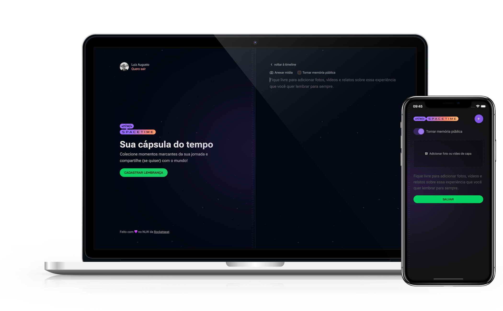

<p align="center">
    
</p>
<br>

# Next Level Week - Spacetime

Here you will find the projects developed during [NLW Spacetime](https://github.com/luizwhite/nlw-spacetime-ignite) from [Rocketseat 🚀](https://rocketseat.com.br).

## Description
Spacetime app is a GitHub project that allows users to create a timeline of posts representing their memories through form submission. This project is designed to provide a visual and interactive way for users to document and revisit their memories over time. 

## Mockups
<p align="center">
    
</p>

## Features
- User-friendly form submission for memory input
- Interactive timeline visualization of memories
- Option to edit and delete memories (TBD)
- Search functionality to easily locate specific memories (TBD)

## Installation
NLW Spacetime consists of three sub-projects: web, mobile, and server. To install each, follow the steps below:

### Web

```bash
git clone https://github.com/luizwhite/nlw-spacetime-ignite-web.git
cd nlw-spacetime-ignite-web npm install npm run dev
```

### Mobile
```bash
git clone https://github.com/luizwhite/nlw-spacetime-ignite-mobile.git
cd nlw-spacetime-ignite-mobile
npm install
npm start
```

### Server
```bash
git clone https://github.com/luizwhite/nlw-spacetime-ignite-server.git
cd nlw-spacetime-ignite-server
npm install
npm run dev
```

## Usage
To use Spacetime App, follow the steps below:

### Web
1. Ensure the backend server is running.
2. Open the web application in your web browser at `http://localhost:3000`.

### Mobile
1. Ensure the backend server is running.
2. Open the mobile application in your Android emulator (Android Studio) or iOS emulator (Xcode).

## Dependencies and Environment Setup
All projects are built with Node.js and require npm. 

### Web
The web project is built with React. The main dependencies are:

- React: ^18
- Next.js: 13.5.4
- Axios: ^1.5.1
- JWT-decode: ^3.1.2
- Lucide-react: ^0.287.0

### Mobile
The mobile project is built with React Native and Expo. The main dependencies are:

- React: 18.2.0
- React Native: 0.72.5
- Axios: ^1.5.1
- Expo: ~49.0.13
- Expo Auth Session: ~5.0.2
- Expo Crypto: ~12.4.1
- Expo Font: ~11.4.0
- Expo Secure Store: ~12.3.1
- Expo Router: ^2.0.0
- NativeWind: ^2.0.11

### Server
The server project is built with Node.js and Fastify. The main dependencies are:

- Fastify: ^4.24.0
- Fastify CORS: ^8.4.0
- Fastify JWT: ^7.2.2
- Fastify Multipart: ^8.0.0
- Fastify Static: ^6.11.2
- Prisma Client: ^5.4.2
- Axios: ^1.5.1
- Zod: ^3.22.4
- Dotenv: ^16.3.1

## License
This project is licensed under the MIT License. For more information, see the [LICENSE](LICENSE) file in the project repository.